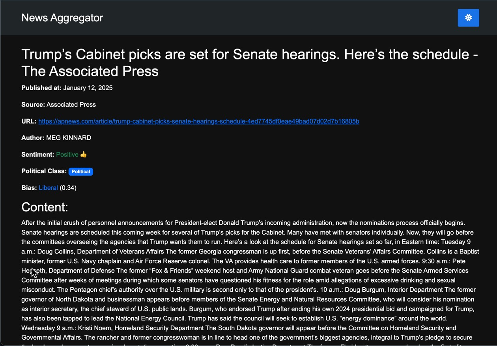

# News Headlines Scraper and Sentiment Analyzer

This Flask-based web application fetches top news headlines from [NEWSAPI.org](https://newsapi.org/), analyzes them for sentiment, political categorization, and potential media bias, and provides a user-friendly interface for exploration.

## Features

- Fetches top news headlines from multiple sources.
- Analyzes:
    - Sentiment (positive, negative, neutral).
    - Political categorization (political vs. non-political).
    - Media bias detection.
- Provides a responsive web interface with:
    - Light/Dark mode toggle.
    - "Read More" links to full articles.
    - "Load More" to access past headlines.
- Generates real-time logs and saves a detailed log file.

## Installation

### Prerequisites

- Python 3.11+.
- [uv package manager](https://docs.astral.sh/uv/getting-started/installation/).
- A [NewsAPI.org](https://newsapi.org/) API key.

### Steps

1. Install `uv`:
    - Follow the [installation guide](https://docs.astral.sh/uv/getting-started/installation/) to install `uv` on your system.
2. Clone the Repository:

    ```sh
    git clone git@github.com:kenny-chua/news-aggregator.git
    cd news-aggregator
    ```

3. Install Dependencies:

    - Use `uv` to sync dependencies:

    ```sh
        uv sync
    ```

4. Set Up the Environment:

    - Create a `.env` file in the root directory with the following format:

    ```env
    NEWSAPI_API_KEY=your_api_key_here
    DB=newslist.db  # Arbitrary SQLite database name
    ```

    - Replace `newslist.db` with your preferred database name if desired.

## Usage

### Manual Scraping

Run the scraper to fetch the latest headlines. Logs will be streamed in real-time and saved to `app.log`:

```sh
uv run python app/app.py
```

### Running the Flask Application

Start the web interface:

```sh
uv run python run.py
```

Open your browser and navigate to `http://127.0.0.1:5000` to access the application.

## Technologies Used

- Python: Core programming language.
- Flask: Web framework for the application.
- NewsAPI.org: Data source for news headlines.
- TextBlob: Sentiment analysis library.
- Hugging Face Models:
    - [dell-research-harvard/topic-politics](https://huggingface.co/dell-research-harvard/topic-politics) for political categorization.
    - [harshal-11/Bert-political-classification](https://huggingface.co/harshal-11/Bert-political-classification) for bias detection.
- Newspaper4k & Playwright: For news scraping.
- SQLite3: Lightweight database backend.
- SQLAlchemy: ORM for database operations.
- HTML/CSS & Bootstrap: For building the web interface.

## Screenshots

### Homepage


### Article



## Acknowledgements

- [TextBlob](https://textblob.readthedocs.io/) for sentiment analysis.
- [Hugging Face](https://huggingface.co/) for providing pre-trained models.
- [NewsAPI.org](https://newsapi.org/) for news headlines.
- [PyBites](https://pybites.github.io/) for Python learning and coaching resources.
